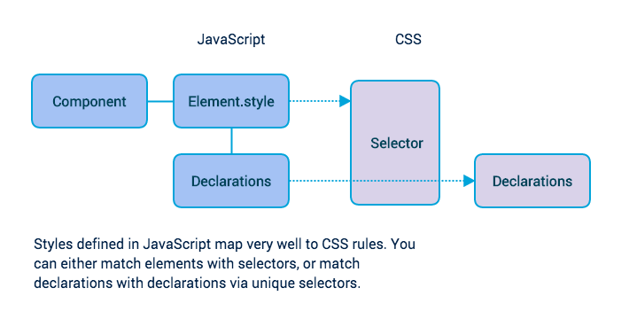

# Styling strategy

Using the `style` attribute would normally produce inline styles. There are
several existing approaches to using the `style` attribute, some of which
convert inline styles to static CSS:
[jsxstyle](https://github.com/petehunt/jsxstyle),
[react-free-style](https://github.com/blakeembrey/react-free-style/),
[react-inline](https://github.com/martinandert/react-inline),
[react-native](https://facebook.github.io/react-native/),
[react-style](https://github.com/js-next/react-style),
[stilr](https://github.com/kodyl/stilr).

## Style syntax: native vs proprietary data structure

React Web SDK (in a divergence from React Native) represents style using plain
JS objects:

```js
<Text style={styles.root}>...</Text>

const styles = {
  root: {
    background: 'transparent',
    display: 'flex',
    flexGrow: 1,
    justifyContent: 'center'
  }
};
```

Most approaches to managing style in React introduce a proprietary data
structure, often via an implementation of `Stylesheet.create`.

```js
<Text style={styles.root}>...</Text>

const styles = Stylesheet.create({
  root: {
    background: 'transparent',
    display: 'flex',
    flexGrow: 1,
    justifyContent: 'center'
  }
});
```

## JS-to-CSS: conversion strategies

One strategy for converting styles from JS to CSS is to map style objects to
CSS rules. Another strategy is to map declarations to declarataions.



Mapping entire `style` objects to CSS rules can lead to increasingly large CSS
files. Each new component adds new rules to the stylesheet.

React Web SDK includes a proof-of-concept for the strategy of automatically
mapping unique declarations to declarations, via a unique selector for each
declaration. This strategy results in smaller CSS files because an application
has fewer unique declarations than total declarations. Creating a new
component with no new unique declarations results in no change to the CSS file.

For example:

```js
<Text style={styles.root}>...</Text>

const styles = {
  root: {
    background: 'transparent',
    display: 'flex',
    flexGrow: 1,
    justifyContent: 'center'
  }
};
```

Yields:

```html
<span className="_abcde _fghij _klmno _pqrst">...</span>
```

And is backed by:

```css
._abcde { background: transparent }
._fghij { display: flex }
._klmno { flex-grow: 1 }
._pqrst { justify-content: center }
```

The current implementation uses a precomputed CSS library of single-declaration
rules, with obfuscated selectors. This handles a signficant portion of possible
declarations. But a build-time implementation would produce more accurate CSS
files and fall through to inline styles significantly less often.


(CSS libraries like [Atomic CSS](http://acss.io/),
[Basscss](http://www.basscss.com/), [SUIT CSS](https://suitcss.github.io/), and
[tachyons](http://tachyons.io/) are attempts to limit style scope and limit
stylesheet growth in a similar way. But they're CSS utility libraries, each with a
particular set of classes and features to learn. All of them require developers
to manually connect CSS classes for given styles.)

## Dynamic styles: use inline styles

Some styles cannot be resolved ahead of time and continue to rely on inline
styles:

```js
<View style={{ backgroundColor: (Math.random() > 0.5 ? 'red' : 'black') }}>...</Text>
```

## Media Queries, pseudo-classes, and pseudo-elements

Media Queries could be replaced with `mediaMatch`. This would have the added
benefit of co-locating breakpoint-specific DOM and style changes. Perhaps Media
Query data could be accessed on `this.content`?

Pseudo-classes like `:hover` and `:focus` can be handled with JavaScript.

Pseudo-elements should be avoided in general, but for particular cases like
`::placeholder` it might be necessary to reimplement it in the SDK's
`TextInput` component (see React Native's API).
